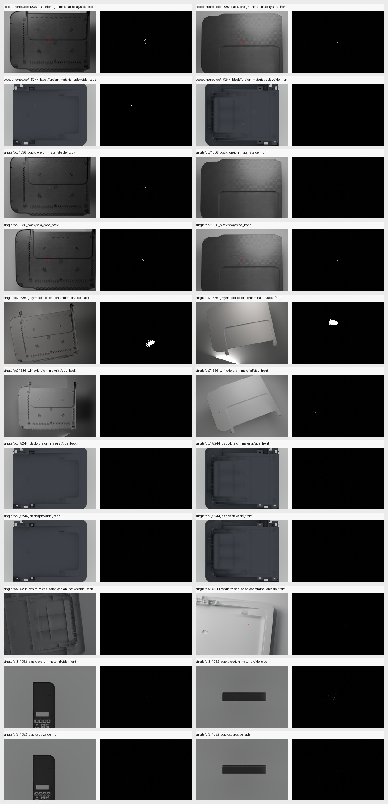
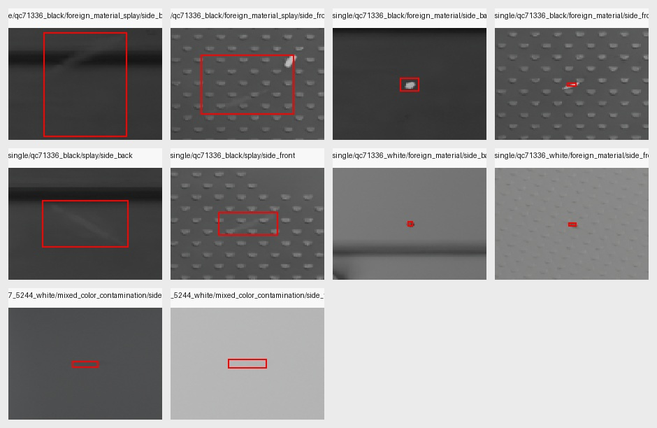

# 已通过缺陷生成渲染指南

Last updated: 2026-05-03

本文档说明当前已人工鉴定通过的非黑点缺陷生成流程、展示图集、使用脚本、模型/profile 文件、评估与抽查方式，以及常用参数含义。

黑点单缺陷请看独立文档：

```text
E:\BlenderProject\BlenderProc\defect_dataset_generator\docs\BLACK_DOT_SINGLE_DEFECT_3K_5K_HANDOFF.md
```

3k 数据集非黑点补齐计划请看：

```text
E:\BlenderProject\BlenderProc\defect_dataset_generator\docs\APPROVED_NON_BLACK_DEFECT_3K_FILLER_HANDOFF.md
```

## 一、当前展示图集

本轮已对所有通过的非黑点组合生成展示样本：front/back 各一张；QL3 使用 front/side 各一张；黑点缺陷全部排除。

展示目录：

```text
E:\BlenderProject\BlenderProc\examples\my_project\approved_defect_showcase_cases_20260503
```

主要文件：

```text
APPROVED_DEFECT_SHOWCASE_overview_rgb_mask.jpg
APPROVED_DEFECT_SHOWCASE_bbox_crops.jpg
showcase_run_summary.json
showcase_summary.json
```

总览图：



局部裁剪图：



说明：

- 左侧为 RGB，并画出 YOLO bbox。
- 右侧为 mask，按阈值 `>=128` 显示为红色。
- 一些样本会被自动质量门判失败，但 RGB/mask/label/metadata 已生成；人工验收以 RGB/mask/bbox crop 为准。

## 二、已通过组合范围

| 模式 | target | defect(s) | sides | 当前状态 |
| --- | --- | --- | --- | --- |
| single | `qc71336_black` | `foreign_material` | front/back | 通过 |
| single | `qc71336_black` | `splay` | front/back | 通过 |
| single | `qc71336_white` | `foreign_material` | front/back | 通过 |
| single | `qc71336_gray` | `mixed_color_contamination` | front/back | 通过 |
| single | `qc7_5244_black` | `foreign_material` | front/back | 通过 |
| single | `qc7_5244_black` | `splay` | front/back | 通过 |
| single | `qc7_5244_white` | `mixed_color_contamination` | front/back | 通过 |
| single | `ql3_1052_black` | `foreign_material` | front/side | 通过 |
| single | `ql3_1052_black` | `splay` | front/side | 通过 |
| cooccurrence | `qc71336_black` | `foreign_material,splay` | front/back | 通过 |
| cooccurrence | `qc7_5244_black` | `foreign_material,splay` | front/back | 通过 |

不包含：

```text
black_dot
sink_mark
ql3_1052_black cooccurrence
```

## 三、核心入口脚本

统一推荐从 app 入口运行，而不是直接调用底层 Blender 脚本：

```text
E:\BlenderProject\BlenderProc\defect_dataset_generator\app.py
```

单缺陷入口：

```powershell
D:\Anaconda\envs\defect_eval\python.exe defect_dataset_generator\app.py generate-target --target <target> --defects <defect> --count <count> --out <out> --samples <samples> --seed <seed> --anchor-sides <side>
```

同场景多缺陷入口：

```powershell
D:\Anaconda\envs\defect_eval\python.exe defect_dataset_generator\app.py generate-target-cooccurrence --target <target> --defects <defect_a>,<defect_b> --count <count> --out <out> --samples <samples> --seed <seed> --anchor-sides <side>
```

运行目录：

```powershell
cd E:\BlenderProject\BlenderProc
```

## 四、profile 与目标注册文件

目标注册文件：

```text
E:\BlenderProject\BlenderProc\defect_dataset_generator\config\model_color_defect_targets.json
```

模型颜色 profile：

```text
E:\BlenderProject\BlenderProc\defect_dataset_generator\config\model_color_profiles.json
```

生成默认值：

```text
E:\BlenderProject\BlenderProc\defect_dataset_generator\config\generation_defaults_registry.json
```

QC7-5244 black 手工材质 profile：

```text
E:\BlenderProject\BlenderProc\defect_dataset_generator\config\qc7_5244_black_visual_material_candidate_v3.json
```

QC7-5244 black surface texture profile：

```text
E:\BlenderProject\BlenderProc\defect_dataset_generator\config\qc7_5244_black_surface_texture_profile_v1.json
```

## 五、模型文件

| target | 主要模型/profile 来源 |
| --- | --- |
| `qc71336_black` | `assets/models/moxing2.blend`, `assets/models/QC7-1336-black.blend`, `assets/models/QC7-1336.stl` |
| `qc71336_white` | `assets/models/moxing2.blend`, `assets/models/QC7-1336-white.blend`, `assets/models/QC7-1336.stl` |
| `qc71336_gray` | `assets/models/moxing2.blend`, `assets/models/QC7-1336-white.blend`, `assets/models/QC7-1336.stl`; 使用 gray material override |
| `qc7_5244_black` | `assets/models/moxing1_test.blend`, `assets/models/QC7-5236.stl`, `qc7_5244_black_visual_material_candidate_v3.json` |
| `qc7_5244_white` | `assets/models/moxing1_test.blend`, `assets/models/QC7-5236.stl`; reference backend 构造白色外观 |
| `ql3_1052_black` | `assets/models/QL3-black.blend`; 材质来自 blend 内嵌 |

注意：`qc7_5244_white` 的 mixed-color backend 保留历史名称 `QC75244`，不要把底层兼容 key 改成其它拼写。

## 六、底层生成脚本对应关系

| target / defect | backend | 底层脚本 |
| --- | --- | --- |
| `qc71336_black foreign_material` | `qc71336_black_reference` | `examples/my_project/reference_blend_qc71336_black_prebuilt_normal_debug.py` |
| `qc71336_black splay` | `qc71336_black_reference` | `examples/my_project/reference_blend_qc71336_black_prebuilt_normal_debug.py` |
| `qc71336_black foreign_material+splay` | `qc71336_black_reference_cooccurrence` | `examples/my_project/reference_blend_qc71336_black_prebuilt_normal_debug.py`, internal `--defect_type foreign_material_splay` |
| `qc71336_white foreign_material` | `qc71336_white_foreign_reference` | `examples/my_project/reference_blend_qc71336_white_prebuilt_normal_debug.py` |
| `qc71336_gray mixed_color_contamination` | `generic_main_plane` | `defect_dataset_generator/blender_scripts/render_generic_main_plane_defects.py` |
| `qc7_5244_black foreign_material` | `generic_main_plane` | `defect_dataset_generator/blender_scripts/render_generic_main_plane_defects.py` |
| `qc7_5244_black splay` | `generic_main_plane` | `defect_dataset_generator/blender_scripts/render_generic_main_plane_defects.py` |
| `qc7_5244_black foreign_material+splay` | `generic_main_plane cooccurrence` | `defect_dataset_generator/blender_scripts/render_generic_main_plane_defects.py` |
| `qc7_5244_white mixed_color_contamination` | `qc75244_mixed_color_reference` | `examples/my_project/reference_blend_qc75244_mixed_color_profile_debug.py` |
| `ql3_1052_black foreign_material` | `generic_main_plane` | `defect_dataset_generator/blender_scripts/render_generic_main_plane_defects.py` |
| `ql3_1052_black splay` | `generic_main_plane` | `defect_dataset_generator/blender_scripts/render_generic_main_plane_defects.py` |

每次运行后必须查看 `generation_plan.json`，确认实际 `backend_script` 与上表一致。

## 七、展示图生成命令

本轮展示图使用 `--samples 16`，每个组合每个 side 生成 1 张。

示例单缺陷：

```powershell
D:\Anaconda\envs\defect_eval\python.exe defect_dataset_generator\app.py generate-target --target qc71336_black --defects foreign_material --count 1 --out E:\BlenderProject\BlenderProc\examples\my_project\approved_defect_showcase_cases_20260503\single\qc71336_black\foreign_material\side_front --samples 16 --seed 81000 --anchor-sides front
```

示例 cooccurrence：

```powershell
D:\Anaconda\envs\defect_eval\python.exe defect_dataset_generator\app.py generate-target-cooccurrence --target qc71336_black --defects foreign_material,splay --count 1 --out E:\BlenderProject\BlenderProc\examples\my_project\approved_defect_showcase_cases_20260503\cooccurrence\qc71336_black\foreign_material_splay\side_front --samples 16 --seed 81600 --anchor-sides front
```

生产数据建议把 `--samples` 改为 `24`。

## 八、常用参数含义

| 参数 | 适用命令 | 含义 |
| --- | --- | --- |
| `--target` | all | 目标 profile id，例如 `qc71336_black`、`ql3_1052_black` |
| `--defects` | all | 缺陷名；单缺陷为一个值，同场景多缺陷用逗号分隔 |
| `--count` | all | 生成图像数量 |
| `--out` | all | 输出目录 |
| `--samples` | all | Cycles 采样数；展示可用 16，生产建议 24 |
| `--seed` | all | 基础随机种子；同一命令内部会递增 |
| `--anchor-sides` | all | 缺陷落面；front/back/side。为保证比例精确，一次只传一个 side |
| `--dry-run` | all | 只写 plan，不实际渲染 |
| `--allow-generic-fallback` | cooccurrence | 允许 reference/specialized 混合时退到 generic 诊断路径；当前已通过生产组合不需要 |
| `--render-class-masks` | cooccurrence | 诊断用：除 merged mask 外，额外输出按类别分开的 mask |
| `--object-transform-mode keep_camera` | generic diagnostics | 诊断用：固定相机/光照，旋转或平移工件 |
| `--object-transform-camera-side` | generic diagnostics | keep_camera 前的相机侧 |
| `--object-rotate-deg` | generic diagnostics | 诊断用世界坐标旋转角 |
| `--object-translate` | generic diagnostics | 诊断用世界坐标平移 |

底层脚本也有自己的参数，例如 `--blend`、`--model_blend`、`--defect_type`、`--num`、`--start_index`、`--anchor_sides`。通常不要手写底层命令，让 `app.py` 根据 profile 自动生成。

## 九、输出结构

典型输出：

```text
output_dir/
  rgb/000000.png
  masks/000000.png
  labels_yolo/000000.txt
  metadata/000000.json
  generation_plan.json
  backend_run_log.json
  _backend/<backend_name>/
```

同场景多缺陷要求：

- merged mask 中包含所有缺陷。
- `labels_yolo/000000.txt` 至少两行。
- `metadata/000000.json` 的 `defects` 列表包含每个缺陷记录。

当前类别约定：

| class id | defect |
| ---: | --- |
| 0 | `black_dot` 或 mixed-color reference 单类输出，按当前 backend label policy 使用 |
| 1 | `foreign_material` |
| 2 | `splay` |
| 3 | `mixed_color_contamination`，部分 generic 路径使用 |

实际 class id 以生成出的 `labels_yolo/*.txt` 与 metadata 为准。

## 十、评估与验收脚本

自动质量检查内置在：

```text
E:\BlenderProject\BlenderProc\defect_dataset_generator\core\renderer.py
function: run_sample_quality_checks
```

它会检查：

- RGB/mask/label/metadata 是否存在。
- mask 是否非空。
- YOLO bbox 是否在 0-1 范围内。
- label bbox 是否和 backend bbox 对齐。
- RGB 是否非空、非过曝、不是纯背景。
- bbox 区域是否有可见 RGB 变化。

图像质量评估：

```powershell
D:\Anaconda\envs\defect_eval\python.exe defect_dataset_generator\tools\evaluate_synthetic_image_quality.py --default-dataset <dataset_a> --fitted-dataset <dataset_b> --real-reference <real_reference> --out <out> --resize 512
```

缺陷真实感评估：

```powershell
D:\Anaconda\envs\defect_eval\python.exe defect_dataset_generator\tools\evaluate_defect_realism.py --real-images <real_images> --real-labels <real_labels> --synthetic-dataset <synthetic_dataset> --defect-type <defect_type> --max-samples 100 --out <out>
```

说明：`evaluate_defect_realism.py` 最早为黑点适配，非黑点结果只能作为辅助参考；最终仍以人工 RGB/mask/bbox crop 为准。

YOLO 数据集标签审计：

```powershell
D:\Anaconda\envs\defect_eval\python.exe defect_dataset_generator\tools\audit_yolo_dataset_labels.py --yaml <data.yaml> --split train --out <audit_out>
```

计划验证：

```powershell
D:\Anaconda\envs\defect_eval\python.exe defect_dataset_generator\tools\validate_defect_plans.py --plans <plan_folder> --model-profile <target> --out <report.json>
```

## 十一、人工 RGB/mask 检查

不要只看自动评估结果。每个组合都要看：

1. RGB 图里缺陷是否在工件表面。
2. mask 是否和 RGB 缺陷对齐。
3. YOLO bbox 是否框住同一个缺陷。
4. front/back 是否确实是不同面。
5. QL3 side 是否确实是侧面，metadata 中应为 `anchor_side=side`、`camera_side=side`、`main_plane_axis=y`。
6. cooccurrence 中两个缺陷是否都在同一张 RGB 里可见，label 是否为两行。

本轮展示图创建逻辑已经把 RGB/mask 总览和 bbox crop 总览保存为：

```text
APPROVED_DEFECT_SHOWCASE_overview_rgb_mask.jpg
APPROVED_DEFECT_SHOWCASE_bbox_crops.jpg
```

## 十二、注意事项

1. QL3 cooccurrence 当前取消，不要恢复。
2. 黑点不属于本文档范围。
3. `qc71336_black splay` 和 QL3 细划痕对比度可能被自动质量门判弱，但用户已按人工 RGB/mask 通过。
4. `qc71336_gray mixed_color_contamination` 之前修过 back 视角背景遮挡；如果 back 再出现背景挡住模型，优先检查 `render_generic_main_plane_defects.py` 的 camera/backdrop 逻辑。
5. 大批量生产必须确认 GPU 启用。generic metadata 中应有 `render_device_info.gpu_enabled=true`。
6. 生产时 front/back 或 front/side 必须分开命令跑，不要依赖随机 side 混合来达到 1:1。

## 十三、当前展示样本状态

本轮共生成 22 个展示样本：

```text
single: 18
cooccurrence: 4
```

有些 app 命令返回 exit code 1，因为自动质量门认为 RGB bbox 对比不足或背景判定不足；但对应 RGB/mask/label/metadata 均已落盘，并已用于展示图集。

完整状态见：

```text
E:\BlenderProject\BlenderProc\examples\my_project\approved_defect_showcase_cases_20260503\showcase_run_summary.json
E:\BlenderProject\BlenderProc\examples\my_project\approved_defect_showcase_cases_20260503\showcase_summary.json
```
